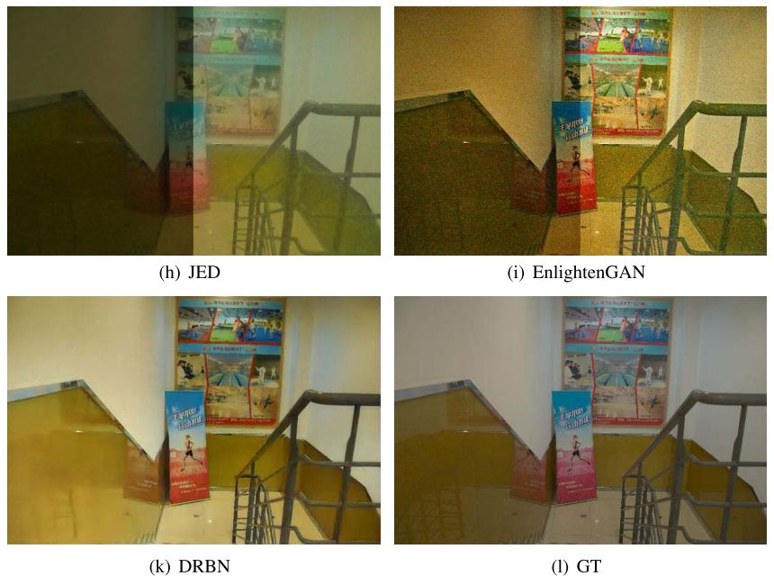

## Band Representation-Based Semi-Supervised Low-Light Image Enhancement: Bridging the Gap Between Signal Fidelity and Perceptual Quality (TIP'2021)

[Wenhan Yang](https://flyywh.github.io/index.html), 
[Shiqi Wang](https://www.cs.cityu.edu.hk/~shiqwang/), 
[Yuming Fang](https://sites.google.com/site/leofangyuming/), 
Yue Wang 
and [Jiaying Liu](http://www.icst.pku.edu.cn/struct/people/liujiaying.html) 

[[Paper Link]](http://39.96.165.147/Pub%20Files/2021/ywh_tip21_2.pdf)
[[Project Page]](https://github.com/flyywh/TIP-2021-Deep-Recursive-Band-Network)

### Abstract

It has been widely acknowledged that under-exposure causes a variety of visual quality degradation because of intensive noise, decreased visibility, biased color, etc. To alleviate these issues, a novel semi-supervised learning approach is proposed in this paper for low-light image enhancement. More specifically, we propose a deep recursive band network (DRBN) to recover a linear band representation of an enhanced normal-light image based on the guidance of the paired low/normal-light images. Such design philosophy enables the principled network to generate a quality improved one by reconstructing the given bands based upon another learnable linear transformation which is perceptually driven by an image quality assessment neural network. On one hand, the proposed network is delicately developed to obtain a variety of coarseto-fine band representations, of which the estimations benefit each other in a recursive process mutually. On the other hand, the extracted band representation of the enhanced image in the recursive band learning stage of DRBN is capable of bridging the gap between the restoration knowledge of paired data and the perceptual quality preference to high-quality images. Subsequently, the band recomposition learns to recompose the band representation towards fitting perceptual regularization of high-quality images with the perceptual guidance. The proposed architecture can be flexibly trained with both paired and unpaired data. Extensive experiments demonstrate that our method produces better enhanced results with visually pleasing contrast and color distributions, as well as well-restored structural details.

#### If you find the resource useful, please cite the following :- )

```
@InProceedings{Yang_2020_CVPR,
author = {Yang, Wenhan and Wang, Shiqi and Fang, Yuming and Wang, Yue and Liu, Jiaying},
title = {From Fidelity to Perceptual Quality: A Semi-Supervised Approach for Low-Light Image Enhancement},
booktitle = {IEEE/CVF Conference on Computer Vision and Pattern Recognition (CVPR)},
month = {June},
year = {2020}
}
```
 

## Installation:

1. Clone this repo
2. Install PyTorch and dependencies from http://pytorch.org 
3. For stage II training, you need to download [[VGG16 Model]](https://download.pytorch.org/models/vgg16-397923af.pth) and put it in DRBL-stage2/src/.
4. For testing, you can directly run test.sh in DRBL-stage1/src/ and DRBL-stage2/src/.
5. For training, you can directly run train.sh in DRBL-stage1/src/ and DRBL-stage2/src/.
6. You can download our dataset here: [[Dataset Link]](https://pan.baidu.com/s/149C65GCvg4lVKLDQqFdvqw) (extracted code: 22im) [Partly updated on 27 March]

（**Note**: the code is suitable for PyTorch 0.4.1）

## Detailed Guidance:

Thank you for your attention!

1. How could I reproduce the objective evaluation results in Table I in the paper？<br>
You can run sh ./DRBL-stage1/src/test.sh <br>
The 1st stage offers better objective results while the other produces better overall subjective visual quality.
In our paper, the methods involved in objective comparisons are not trained with adversarial/quality losses. <br>

2. Data structure
You can see src\data\lowlight.py and src\data\lowlighttest.py for those details in the code of each stage.<br><br>
In the 1st stage: <br>
hr --> normal-light images, lr --> low-light images <br>
lr and hr are paired. <br> <br>
In the 2nd stage: <br>
hr --> normal-light images, lr --> low-light images <br>
lr and hr are paired. <br>
lrr --> low-light images in the real applications, hq --> high quality dataset <br>

3. Dataset
You can obtain the dataset via: [[Dataset Link]](https://pan.baidu.com/s/149C65GCvg4lVKLDQqFdvqw) (extracted code: 22im) [Partly updated on 27 March] <br>
We introduce these collections here: <br>
a) Our_low: real captured low-light images in LOL for training; <br>
b) Our_normal: real captured normal-light images in LOL for training; <br>
c) Our_low_test: real captured low-light images in LOL for testing; <br>
d) Our_normal_test: real captured normal-light images in LOL for testing; <br>
e) AVA_good_2: the high-quality images selected from the AVA dataset based on the MOS values; <br>
f) Low_real_test_2_rs: real low-light images selected from LIME, NPE, VV, DICM, the typical unpaired low-light testing datasets; <br>
g) Low_degraded: synthetic low-light images in LOL for training; <br>
h) Normal: synthetic normal-light images in LOL for training; <br>

4. Image number in LOL <br>
LOL: Chen Wei, Wenjing Wang, Wenhan Yang, and Jiaying Liu. "Deep Retinex Decomposition for Low-Light Enhancement", BMVC, 2018. [[Baiduyun (extracted code: sdd0)]](https://pan.baidu.com/s/1spt0kYU3OqsQSND-be4UaA) [[Google Drive]](https://drive.google.com/file/d/18bs_mAREhLipaM2qvhxs7u7ff2VSHet2/view?usp=sharing) <br>
LOL-v2 (the extension work): Wenhan Yang, Haofeng Huang, Wenjing Wang, Shiqi Wang, and Jiaying Liu. "Sparse Gradient Regularized Deep Retinex Network for Robust Low-Light Image Enhancement", TIP, 2021. [[Baiduyun (extracted code: l9xm)]](https://pan.baidu.com/s/1U9ePTfeLlnEbr5dtI1tm5g) [[Google Drive]](https://drive.google.com/file/d/1dzuLCk9_gE2bFF222n3-7GVUlSVHpMYC/view?usp=sharing) <br> <br>
We use LOL-v2 as it is larger and more diverse. In fact, it is quite unexpected that the work of LOL-v2 is published later than this, which might also bother followers.<br> <br>
I think you can choose which one to follow freely. <br>

5. Pytorch version <br>
Only 0.4 and 0.41 currently. <br> If you have to use more advanced versions, which might be constrained to the GPU device types, you might access Wang Hong's github for the idea to replace parts of the dataloader: [[New Dataloader]](https://github.com/hongwang01/RCDNet/tree/master/pytorch1.0%2B/for_syn/src) <br> 

6. Why does stage 2 have two branches? <br>
The distributions of LOL and LIME, NPE, VV, DICM are quite different. <br>
We empirically found that it will lead to better performance if two models and the corresponding training data are adopted.


## Contact

If you have questions, you can contact `yangwenhan@pku.edu.cn`.
A timely response is promised, if the email is sent by your affliaton email with your signed name.
